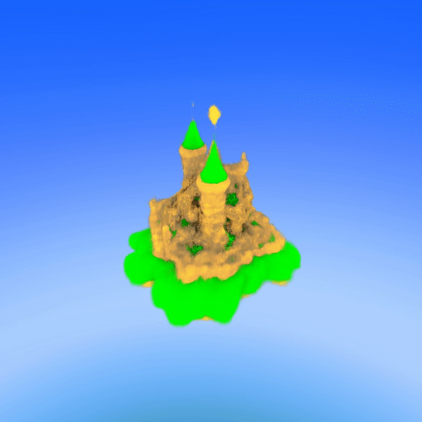
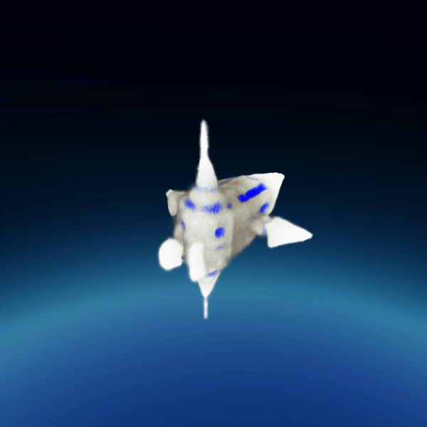
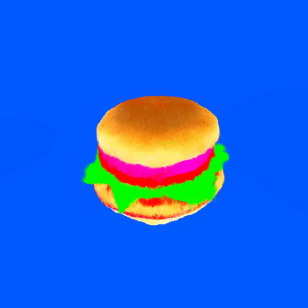

# Fuzzy Fusion
by Junyoung Seok and Steven Feng

## to run
``` bash
npm i # to install dependencies.
npm run dev #to run the application.
```
## Demo

corgi wizard

floating castle

spaceship

three ears panda

burger

## Inspiration
The inspiration of this project came from the contour design on the gift bag design of UofTHacks-X. A contour is created by removing a dimension from a 3D object, which got us thinking, is it possible to insert a dimension to an image to make it 3D?

Dall e AI wowed the world with text to image generation earlier this year, and in this project, we want to break the bound of 2 dimensions and generate 3D object using text as the latest breakthrough in neural radiance field (NeRF) and image generation from text made this possible.

## What it does
Our site uses a text based input to create a 3D textured mesh using stable diffusion techniques, and uploads it to a decentralized storage with a Non-fungible token (NFT) for fast and secure storage. We also open to the idea of trading these AI generated objects as NFTs in the future.

## How we built it
The full stack webapp was developed using node.js and javascript. {write more}. Javascript backend calls accepts a user input, augments it using cohere's language generation algorithm to create a more detailed prompt for the object generation algorithm to generate more specific objects. After the object is generated, the mesh and the texture file is rendered using webGL and three.js so the user can manipulate it directly. Furthermore, the object is uploaded to Protocol Lab's estuary decentralized storage with a token and can be downloaded by the users.

The 3D object generation algorithm was implemented in Python and CUDA based on dreamfusion's text to AI algorithm. The network uses stable diffusion techniques to generate multiple 2D images based on text input and fuses these 2D text images using NeRF (neural radiance field) to create a 3D object.

## Challenges we ran into
We encountered numerous challenges with running the 3D object generator because stable diffusion algorithm requires humongous amount of processing required to turn a blurry fuzzy point cloud to an object. For example,  RTX 3090 GPU with 24GB of VRAM needed to run for 45 minutes straight to generate a  mesh like the hamburger in high resolution which takes too long for the demo. So we had to tweak the model parameters such as learning rate, iterations to find the best balance between time and quality to keep the generation time under 15 minutes.

## Accomplishments that we're proud of
We successfully learned and connected many new technologies in this project, from stable diffusion for object generation, to object rendering using three.js and webGL, to decentralized storage and language generation models, we came a long way

## What we learned
1. Stable diffusion for object generation and how NeRF works
2. Web based rendering using three.js and webGL
3. Decentralized storage using protocol lab estuary
4. Cohere language generation model

## What's next for Fuzzy Dreams
Buy and sale AI generated NFTs and metaverse VR integration 
